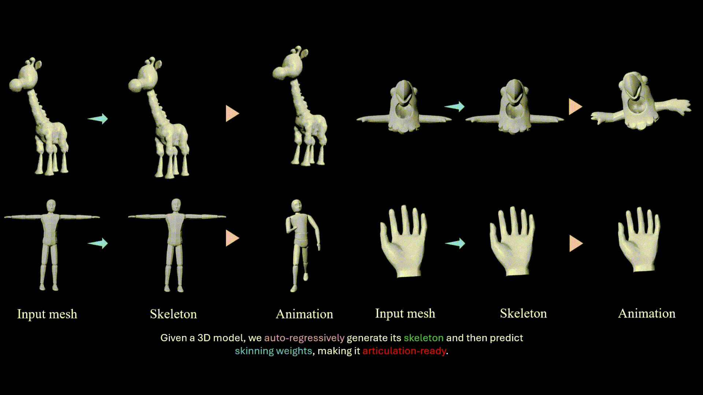

# Awesome Auto-regressive in GenerativeAI 
A curated list of awesome auto-regressive papers in generative AI, inspired by [awesome-NeRF](https://github.com/awesome-NeRF/awesome-NeRF).

 
 

  

(Source: <a href="https://buaacyw.github.io/meshanything-v2/">MeshAnythingV2</a>, <a href="https://daoyig.github.io/Mesh_Art/">MeshArt</a>, and <a href="https://chaoyuesong.github.io/MagicArticulate/">MagicArticulate</a>.)

## Table of contents

- [3D Generation](#3d-generation)
  - [3D Shape Generation](#3D-SHAPE-generation)  
  - [Articulated Object Generation](#articulated-object-generation)  
  - [Automatic Rigging](#automatic-rigging)  
  - [Motion Generation](#motion-generation)
  - [4D Generation](#4d-generation)  
  - [Camera Generation](#camera-generation)
  - [Garment Generation](#garment-generation)  
  - [CAD Generation](#cad-generation)
- [Image Generation](#image-generation)
- [Video Generation](#video-generation)

<b>Change Log:</b>

**Jun 18, 2025**: Add [Self Forcing](https://self-forcing.github.io/), [VideoMAR](https://yuhuustc.github.io//projects/VideoMAR.html) and [Seaweed APT2](https://seaweed-apt.com/2) for videogen, [AR-RAG](https://arxiv.org/abs/2506.06962),
[MADFormer](https://arxiv.org/abs/2506.07999), [SkipVAR](https://github.com/fakerone-li/SkipVAR), [TransDiff](https://arxiv.org/abs/2506.09482), [Pisces](https://arxiv.org/abs/2506.10395) and [SpectralAR](https://huang-yh.github.io/spectralar/) for image generation. 
 
**Jun 6, 2025**: Add [HMAR](https://arxiv.org/pdf/2506.04421) (hierarchical masked ar for image generation), [MS_SR_VAR](https://arxiv.org/abs/2506.04990) (image super resolution), and [AliTok](https://github.com/ali-vilab/alitok) (align the token modeling between tokenizer and ar model)
 

 

### 3D Generation

3D Shape Generation

- [LTM3D: Bridging Token Spaces for Conditional 3D Generation with Auto-Regressive Diffusion Framework](https://arxiv.org/abs/2505.24245), Kang et al., arXiv 2025
- [OctGPT: Octree-based Multiscale Autoregressive Models for 3D Shape Generation](https://arxiv.org/abs/2504.09975), Wei et al., SIGGRAPH 2025 | [Code](https://github.com/octree-nn/octgpt)
- [Efficient Autoregressive Shape Generation via Octree-Based Adaptive Tokenization](https://arxiv.org/abs/2504.02817), Deng et al., arXiv 2025 | [Project](https://oat-3d.github.io/)
- [TreeMeshGPT: Artistic Mesh Generation with Autoregressive Tree Sequencing](https://arxiv.org/abs/2503.11629), Lionar et al., CVPR 2025 | [Code](https://github.com/sail-sg/TreeMeshGPT)
- [DeepMesh: Auto-Regressive Artist-mesh Creation with Reinforcement Learning](https://arxiv.org/abs/2503.15265), Zhao et al., arXiv 2025 | [Project](https://zhaorw02.github.io/DeepMesh/) | [Code](https://github.com/zhaorw02/DeepMesh)
- [MeshPad: Interactive Sketch Conditioned Artistic-designed Mesh Generation and Editing](https://arxiv.org/abs/2503.01425), Li et al., arXiv 2025 | [Project](https://derkleineli.github.io/meshpad/) | [Video](https://www.youtube.com/watch?v=ql37mWf4pg8)
- [AR-1-to-3: Single Image to Consistent 3D Object Generation via Next-View Prediction](https://arxiv.org/abs/2503.12929), Zhang et al., arXiv 2025 | [Project](https://zhangxuying1004.github.io/projects/AR123/) | [Code](https://github.com/HVision-NKU/AR123)
- [MARS: Mesh AutoRegressive Model for 3D Shape Detailization](https://arxiv.org/abs/2502.11390), Gao et al., arXiv 2025
- [Nautilus: Locality-aware Autoencoder for Scalable Mesh Generation](https://arxiv.org/abs/2501.14317), Wang et al., arXiv 2025 | [Project](https://nautilusmeshgen.github.io/) | [Code](https://github.com/yuxuan-w/nautilus)
- [TAR3D: Creating High-Quality 3D Assets via Next-Part Prediction](https://arxiv.org/abs/2412.16919), Zhang et al., arXiv 2024 | [Code](https://github.com/HVision-NKU/TAR3D)
- [3D representation in 512-Byte: Variational tokenizer is the key for autoregressive 3D generation](https://arxiv.org/abs/2412.02202), Zhang et al., arXiv 2024 | [Project](https://sparse-mvs-2.github.io/VAT.IO/) | [Code](https://github.com/sparse-mvs-2/VAT)
- [3D-WAG: Hierarchical Wavelet-Guided Autoregressive Generation for High-Fidelity 3D Shapes](https://arxiv.org/abs/2411.19037), Medi et al., arXiv 2024 
- [Scaling Mesh Generation via Compressive Tokenization](https://arxiv.org/abs/2411.07025), Weng et al., arXiv 2024 | [Project](https://whaohan.github.io/bpt/) | [Code](https://github.com/whaohan/bpt)
- [EdgeRunner: Auto-regressive Auto-encoder for Artistic Mesh Generation](https://arxiv.org/abs/2409.18114), Tang et al., ICLR 2025 | [Project](https://research.nvidia.com/labs/dir/edgerunner/) | [Code](https://github.com/NVlabs/EdgeRunner)
- [MeshAnything V2: Artist-Created Mesh Generation with Adjacent Mesh Tokenization](https://arxiv.org/abs/2408.02555), Chen et al., arXiv 2024 | [Project](https://buaacyw.github.io/meshanything-v2/) | [Code](https://github.com/buaacyw/MeshAnythingV2) | [Video]()
- [MeshAnything: Artist-Created Mesh Generation with Autoregressive Transformers](https://arxiv.org/abs/2406.10163), Chen et al., ICLR 2025 | [Project](https://buaacyw.github.io/mesh-anything/) | [Code](https://github.com/buaacyw/MeshAnything)
- [MeshXL: Neural Coordinate Field for Generative 3D Foundation Models](https://arxiv.org/abs/2405.20853), Chen et al., NeurIPS 2024 | [Project](https://meshxl.github.io/) | [Code](https://github.com/OpenMeshLab/MeshXL)
- [Pivotmesh: Generic 3d mesh generation via pivot vertices guidance.](https://arxiv.org/abs/2405.16890), Weng et al., ICLR 2025 | [Project](https://whaohan.github.io/pivotmesh/) | [Code](https://github.com/whaohan/pivotmesh)
- [MeshGPT: Generating Triangle Meshes with Decoder-Only Transformers](https://arxiv.org/abs/2311.15475), Siddiqui et al., CVPR 2024 Highlight | [Project](https://nihalsid.github.io/mesh-gpt/) | [Code](https://github.com/audi/MeshGPT) | [Video](https://www.youtube.com/watch?v=UV90O1_69_o)
- [Autoregressive 3D Shape Generation via Canonical Mapping](https://arxiv.org/abs/2204.01955), Cheng et al., ECCV 2022 | [Code](https://github.com/AnjieCheng/CanonicalVAE)
- [ShapeFormer: Transformer-based Shape Completion via Sparse Representation](https://arxiv.org/abs/2201.10326), Yan et al., CVPR 2022 | [Project](https://shapeformer.github.io/) | [Code](https://github.com/qheldiv/shapeformer)
- [AutoSDF: Shape Priors for 3D Completion, Reconstruction and Generation](https://arxiv.org/abs/2203.09516), Mittal et al., CVPR 2022 | [Project](https://yccyenchicheng.github.io/AutoSDF/) | [Code](https://github.com/yccyenchicheng/AutoSDF/)
- [PolyGen: An Autoregressive Generative Model of 3D Meshes](https://arxiv.org/abs/2002.10880), Nash et al., ICML 2020 | [Code](https://github.com/google-deepmind/deepmind-research/tree/master/polygen)

Articulated Object Generation

- [MeshArt: Generating Articulated Meshes with Structure-guided Transformers](https://arxiv.org/abs/2412.11596), Gao et al., arXiv 2024 | [Project](https://daoyig.github.io/Mesh_Art/) | [Code](https://github.com/Seed3D/MagicArticulate) | [Video](https://www.youtube.com/embed/0XaHFbmb_FQ?si=xKZOdhQDNFMmUmm5) | [Data](https://syncandshare.lrz.de/getlink/fi4Moni3SkJJeFA8HAEZdR/release_v1)

Automatic Rigging

- [MagicArticulate: Make Your 3D Models Articulation-Ready](https://arxiv.org/abs/2502.12135), Song et al., CVPR 2025 | [Project](https://chaoyuesong.github.io/MagicArticulate/) | [Code](https://github.com/Seed3D/MagicArticulate) | [Video](https://www.youtube.com/watch?v=eJP_VR4cVnk) | [Data](https://huggingface.co/datasets/chaoyue7/Articulation-XL2.0)
- [RigAnything: Template-Free Autoregressive Rigging for Diverse 3D Assets](https://arxiv.org/abs/2502.09615), Liu et al., arXiv 2025 | [Project](https://www.liuisabella.com/RigAnything/) | [Video](https://www.liuisabella.com/RigAnything/#full_video)

Motion Generation

- [Towards Robust and Controllable Text-to-Motion via Masked Autoregressive Diffusion](https://arxiv.org/abs/2505.11013), Zhang et al., arXiv 2025
- [ARTalk: Speech-Driven 3D Head Animation via Autoregressive Model](https://arxiv.org/abs/2502.20323), Chu et al., arXiv 2025 | [Project](https://xg-chu.site/project_artalk/)
- [ScaMo: Exploring the Scaling Law in Autoregressive Motion Generation Model](https://arxiv.org/abs/2412.14559), Lu et al., arXiv 2024 | [Project](https://shunlinlu.github.io/ScaMo/) | [Code](https://github.com/shunlinlu/ScaMo_code)
- [Synergy and Synchrony in Couple Dances](https://arxiv.org/abs/2409.04440), Maluleke et al., arXiv 2024 | [Project](https://von31.github.io/synNsync/)
- [BAMM: Bidirectional Autoregressive Motion Model](https://arxiv.org/abs/2403.19435), Pinyoanuntapong et al., ECCV 2024 | [Project](https://exitudio.github.io/BAMM-page/) | [Code](https://github.com/exitudio/BAMM/)
- [MoMask: Generative Masked Modeling of 3D Human Motions](https://arxiv.org/abs/2312.00063), Guo et al., CVPR 2024 | [Project](https://ericguo5513.github.io/momask/) | [Code](https://github.com/EricGuo5513/momask-codes) | [Demo](https://huggingface.co/spaces/MeYourHint/MoMask)
- [HumanTOMATO: Text-aligned Whole-body Motion Generation](https://arxiv.org/abs/2310.12978), Lu et al., ICML 2024 | [Project](https://lhchen.top/HumanTOMATO/) | [Code](https://github.com/IDEA-Research/HumanTOMATO)
- [MotionGPT: Human Motion as Foreign Language](https://arxiv.org/abs/2306.14795), Jiang et al., NeurIPS 2023 | [Project](https://motion-gpt.github.io/) | [Code](https://github.com/OpenMotionLab/MotionGPT) | [Demo](https://huggingface.co/spaces/OpenMotionLab/MotionGPT)
- [T2M-GPT: Generating Human Motion from Textual Descriptions with Discrete Representations](https://arxiv.org/abs/2301.06052), Zhang et al., CVPR 2023 | [Project](https://mael-zys.github.io/T2M-GPT/) | [Code](https://github.com/Mael-zys/T2M-GPT) | [Demo](https://huggingface.co/spaces/vumichien/Generate_human_motion)
- [TM2T: Stochastical and Tokenized Modeling for the Reciprocal Generation of 3D Human Motions and Texts](https://arxiv.org/abs/2207.01696), Guo et al., ECCV 2022 | [Project](https://ericguo5513.github.io/TM2T/) | [Code](https://github.com/EricGuo5513/TM2T)

4D Generation

- [AR4D: Autoregressive 4D Generation from Monocular Videos](https://arxiv.org/abs/2501.01722), Zhu et al., arXiv 2025 | [Project](https://hanxinzhu-lab.github.io/AR4D/)

Camera Generation

- [GenDoP: Auto-regressive Camera Trajectory Generation as a Director of Photography](https://arxiv.org/abs/2504.07083), Zhang et al., arXiv 2025 | [Project](https://kszpxxzmc.github.io/GenDoP/) | [Code](https://github.com/3DTopia/GenDoP)

Garment Generation

- [GarmentX: Autoregressive Parametric Representations for High-Fidelity 3D Garment Generation](https://arxiv.org/abs/2504.20409), Guo et al., arXiv 2025
- [DressCode: Autoregressively Sewing and Generating Garments from Text Guidance](https://arxiv.org/abs/2401.16465), He et al., SIGGRAPH 2024 | [Project](https://ihe-kaii.github.io/DressCode/) | [Code](https://github.com/IHe-KaiI/DressCode) | [Video](https://www.youtube.com/watch?v=ofFyJBKL-Qg&feature=youtu.be)

CAD Generation

- [SkexGen: Autoregressive Generation of CAD Construction Sequences with Disentangled Codebooks](https://arxiv.org/abs/2207.04632), Xu et al., ICML 2022 | [Project](https://samxuxiang.github.io/skexgen/) | [Code](https://github.com/samxuxiang/SkexGen) | [Video](https://www.youtube.com/watch?v=j5LB7yMwNVE)

### Image Generation

Image Generation

- [AR-RAG: Autoregressive Retrieval Augmentation for Image Generation](https://arxiv.org/abs/2506.06962), Qi et al., arXiv 2025
- [MADFormer: Mixed Autoregressive and Diffusion Transformers for Continuous Image Generation](https://arxiv.org/abs/2506.07999), Chen et al., arXiv 2025
- [SkipVAR: Accelerating Visual Autoregressive Modeling via Adaptive Frequency-Aware Skipping](https://arxiv.org/abs/2506.08908), Li et al., arXiv 2025 | [Code](https://github.com/fakerone-li/SkipVAR)
- [Marrying Autoregressive Transformer and Diffusion with Multi-Reference Autoregression](https://arxiv.org/abs/2506.09482), Zhen et al., arXiv 2025 | [Code](https://github.com/TransDiff/TransDiff)
- [Pisces: An Auto-regressive Foundation Model for Image Understanding and Generation](https://arxiv.org/abs/2506.10395), Xu et al., arXiv 2025
- [SpectralAR: Spectral Autoregressive Visual Generation](https://arxiv.org/abs/2506.10962), Huang et al., arXiv 2025 | [Project](https://huang-yh.github.io/spectralar/) | [Code](https://github.com/huang-yh/SpectralAR)
- [AliTok: Towards Sequence Modeling Alignment between Tokenizer and Autoregressive Model](https://arxiv.org/abs/2506.05289), Wu et al., arXiv 2025 | [Code](https://github.com/ali-vilab/alitok)
- [HMAR: Efficient Hierarchical Masked Auto-Regressive Image Generation](https://arxiv.org/abs/2506.04421), Kumbong et al., arXiv 2025
- [Multi-scale Image Super Resolution with a Single Auto-Regressive Model](https://arxiv.org/abs/2506.04990), Sanchez et al., arXiv 2025 | [Code](https://github.com/saic-fi/ms_sr_var)
- [ReasonGen-R1: CoT for Autoregressive Image Generation model through SFT and RL](https://arxiv.org/abs/2505.24875), Zhang et al., arXiv 2025 | [Project](https://reasongen-r1.github.io/) | [Code](https://github.com/Franklin-Zhang0/ReasonGen-R1)
- [REOrdering Patches Improves Vision Models](https://arxiv.org/abs/2505.23751), Kutscher et al., arXiv 2025 | [Project](https://d3tk.github.io/REOrder/) | [Code](https://github.com/d3tk/REOrder)
- [D-AR: Diffusion via Autoregressive Models](https://arxiv.org/abs/2505.23660), Gao et al., arXiv 2025 | [Code](https://github.com/showlab/D-AR)
- [Fine-Tuning Next-Scale Visual Autoregressive Models with Group Relative Policy Optimization](https://arxiv.org/abs/2505.23331), Gallici et al., arXiv 2025
- [LayerPeeler: Autoregressive Peeling for Layer-wise Image Vectorization](https://arxiv.org/abs/2505.23740), Wu et al., arXiv 2025 | [Project](https://layerpeeler.github.io/)
- [DetailFlow: 1D Coarse-to-Fine Autoregressive Image Generation via Next-Detail Prediction](https://arxiv.org/abs/2505.21473), Liu et al., arXiv 2025 | [Code](https://github.com/ByteFlow-AI/DetailFlow)
- [DiSA: Diffusion Step Annealing in Autoregressive Image Generation](https://arxiv.org/abs/2505.20297), Zhao et al., arXiv 2025 | [Code](https://github.com/Qinyu-Allen-Zhao/DiSA)
- [Hierarchical Masked Autoregressive Models with Low-Resolution Token Pivots](https://arxiv.org/abs/2505.20288), Zheng et al., ICML 2025 | [Code](https://github.com/HiDream-ai/himar)
- [RestoreVAR: Visual Autoregressive Generation for All-in-One Image Restoration](https://arxiv.org/abs/2505.18047), Rajagopalan et al., arXiv 2025 | [Project](https://sudraj2002.github.io/restorevarpage/)
- [Conditional Panoramic Image Generation via Masked Autoregressive Modeling](https://arxiv.org/abs/2505.16862), Li et al., arXiv 2025 | [Project](https://wang-chaoyang.github.io/project/par/)
- [TensorAR: Refinement is All You Need in Autoregressive Image Generation](https://arxiv.org/abs/2505.16324), Cheng et al., arXiv 2025
- [MVAR: Visual Autoregressive Modeling with Scale and Spatial Markovian Conditioning](https://arxiv.org/abs/2505.12742), Zhang et al., arXiv 2025 | [Code](https://github.com/LabShuHangGU/MVAR)
- [VTBench: Evaluating Visual Tokenizers for Autoregressive Image Generation](https://arxiv.org/abs/2505.13439), Lin et al., arXiv 2025 | [Code](https://github.com/huawei-lin/VTBench)
- [MVAR: Visual Autoregressive Modeling with Scale and Spatial Markovian Conditioning](https://arxiv.org/abs/2505.12742), Zhang et al., arXiv 2025 | [Code](https://github.com/LabShuHangGU/MVAR)
- [VTBench: Evaluating Visual Tokenizers for Autoregressive Image Generation](https://arxiv.org/abs/2505.13439), Lin et al., arXiv 2025 | [Code](https://github.com/huawei-lin/VTBench)
- [Token-Shuffle: Towards High-Resolution Image Generation with Autoregressive Models](https://arxiv.org/abs/2504.17789), Ma et al., arXiv 2025 | [Project](https://ma-xu.github.io/token-shuffle/)
- [Distilling Semantically Aware Orders for Autoregressive Image Generation](https://arxiv.org/abs/2504.13162), Pramanik et al., arXiv 2025
- [Personalized Text-to-Image Generation with Auto-Regressive Models](https://arxiv.org/abs/2504.13162), Sun et al., arXiv 2025 | [Code](https://github.com/KaiyueSun98/T2I-Personalization-with-AR)
- [Autoregressive Distillation of Diffusion Transformers](https://arxiv.org/abs/2504.11295), Kim et al., CVPR 2025 Oral | [Code](https://github.com/alsdudrla10/ARD)
- [SimpleAR: Pushing the Frontier of Autoregressive Visual Generation through Pretraining, SFT, and RL](https://arxiv.org/abs/2504.11455), Wang et al., arXiv 2025 | [Code](https://github.com/wdrink/SimpleAR)
- [GigaTok: Scaling Visual Tokenizers to 3 Billion Parameters for Autoregressive Image Generation](https://arxiv.org/abs/2504.08736), Xiong et al., arXiv 2025 | [Project](https://silentview.github.io/GigaTok/) | [Code](https://github.com/SilentView/GigaTok)
- [Anchor Token Matching: Implicit Structure Locking for Training-free AR Image Editing](https://arxiv.org/abs/2504.10434), Hu et al., arXiv 2025 | [Code](https://github.com/hutaiHang/ATM)
- [D2C: Unlocking the Potential of Continuous Autoregressive Image Generation with Discrete Tokens](https://arxiv.org/abs/2503.17155), Wang et al., arXiv 2025
- [Unified Autoregressive Visual Generation and Understanding with Continuous Tokens](https://arxiv.org/abs/2503.10696), Fan et al., arXiv 2025
- [Neighboring Autoregressive Modeling for Efficient Visual Generation](https://arxiv.org/abs/2503.10696), He et al., arXiv 2025 | [Project](https://yuanyu0.github.io/nar/) | [Code](https://github.com/ThisisBillhe/NAR)
- [NFIG: Autoregressive Image Generation with Next-Frequency Prediction](https://arxiv.org/abs/2503.07076), Huang et al., arXiv 2025
- [Frequency Autoregressive Image Generation with Continuous Tokens](https://arxiv.org/abs/2503.05305), Yu et al., arXiv 2025 | [Project](https://yuhuustc.github.io//projects/FAR.html) | [Code](https://github.com/yuhuUSTC/FAR)
- [Beyond Next-Token: Next-X Prediction for Autoregressive Visual Generation](https://arxiv.org/abs/2502.20388), Ren et al., arXiv 2025 | [Code](https://oliverrensu.github.io/project/xAR/)
- [FlexVAR: Flexible Visual Autoregressive Modeling without Residual Prediction](https://arxiv.org/abs/2502.20313), Jiao et al., arXiv 2025 | [Project](https://epiphqny.github.io/PAR-project/) | [Code](https://github.com/jiaosiyu1999/FlexVAR)
- [Autoregressive Image Generation Guided by Chains of Thought](https://arxiv.org/abs/2502.16965), Cai et al., arXiv 2025
- [Generative Autoregressive Transformers for Model-Agnostic Federated MRI Reconstruction](https://arxiv.org/abs/2502.04521), Nezhad et al., arXiv 2025
- [Infinity: Scaling Bitwise AutoRegressive Modeling for High-Resolution Image Synthesis](https://arxiv.org/abs/2412.04431), Han et al., arXiv 2024 | [Project](https://foundationvision.github.io/infinity.project/) | [Code](https://github.com/FoundationVision/Infinity)
- [Parallelized Autoregressive Visual Generation](https://arxiv.org/abs/2412.15119), Wang et al., CVPR 2025 | [Project](https://epiphqny.github.io/PAR-project/) | [Code](https://github.com/Epiphqny/PAR)
- [RandAR: Decoder-only Autoregressive Visual Generation in Random Orders](https://arxiv.org/abs/2412.01827), Pang et al., CVPR 2025 | [Project](https://rand-ar.github.io/) | [Code](https://github.com/ziqipang/RandAR)
- [Randomized Autoregressive Visual Generation](https://arxiv.org/abs/2411.00776), Yu et al., arXiv 2024 | [Project](https://yucornetto.github.io/projects/rar.html) | [Code](https://github.com/bytedance/1d-tokenizer) | [Demo](https://huggingface.co/spaces/yucornetto/RAR)
- [Fluid: Scaling Autoregressive Text-to-image Generative Models with Continuous Tokens](https://arxiv.org/abs/2410.13863), Fan et al., ICLR 2025
- [Customize Your Visual Autoregressive Recipe with Set Autoregressive Modeling](https://arxiv.org/abs/2410.10511), Liu et al., arXiv 2024 | [Project](https://poppuppy.github.io/sar.github.io/) | [Code](https://github.com/poppuppy/SAR)
- [Autoregressive Image Generation without Vector Quantization](https://arxiv.org/abs/2406.11838), Li et al., NeurIPS 2024 Spotlight | [Code](https://github.com/LTH14/mar)
- [Autoregressive Model Beats Diffusion: Llama for Scalable Image Generation](https://arxiv.org/abs/2406.06525), Sun et al., arXiv 2024 | [Project](https://peizesun.github.io/llamagen/) | [Code](https://github.com/FoundationVision/LlamaGen)
- [Visual Autoregressive Modeling: Scalable Image Generation via Next-Scale Prediction](https://arxiv.org/abs/2404.02905), Tian et al., NeruIPS 2024 Best Paper | [Code](https://github.com/FoundationVision/VAR)
- [Muse: Text-To-Image Generation via Masked Generative Transformers](https://arxiv.org/abs/2301.00704), Chang et al., PMLR 2023 | [Project](https://muse-model.github.io/)
- [Scaling Autoregressive Models for Content-Rich Text-to-Image Generation](https://arxiv.org/abs/2206.10789), Yu et al., TMLR 2022 
- [Autoregressive Image Generation using Residual Quantization](https://arxiv.org/abs/2203.01941), Lee et al., CVPR 2022 | [Code](https://github.com/kakaobrain/rq-vae-transformer)
- [Vector-quantized Image Modeling with Improved VQGAN](https://arxiv.org/abs/2110.04627), Yu et al., ICLR 2022 | [Project](https://research.google/blog/vector-quantized-image-modeling-with-improved-vqgan/)
- [Taming Transformers for High-Resolution Image Synthesis](https://arxiv.org/abs/2012.09841), Esser et al., CVPR 2021 | [Code](https://github.com/CompVis/taming-transformers)
- [Generative Pretraining from Pixels](https://cdn.openai.com/papers/Generative_Pretraining_from_Pixels_V2.pdf), Chen et al., ICML 2020 | [Code](https://github.com/openai/image-gpt)
- [Parallel Multiscale Autoregressive Density Estimation](https://arxiv.org/abs/1703.03664), Reed et al., ICML 2017
- [Conditional Image Generation with PixelCNN Decoders](https://arxiv.org/abs/1606.05328), Van den Oord et al., NIPS 2016 | [Code](https://github.com/anantzoid/Conditional-PixelCNN-decoder)

### Video generation

Video Generation

- [Autoregressive Adversarial Post-Training for Real-Time Interactive Video Generation](https://arxiv.org/abs/2506.09350), Lin et al., arXiv 2025 | [Project](https://seaweed-apt.com/2)
- [Self Forcing: Bridging the Train-Test Gap in Autoregressive Video Diffusion ](https://arxiv.org/pdf/2506.08009), Huang et al., arXiv 2025 | [Project](https://self-forcing.github.io/) | [Code](https://github.com/guandeh17/Self-Forcing)
- [VideoMAR: Autoregressive Video Generation with Continuous Tokens](https://arxiv.org/pdf/2506.14168), Yu et al., arXiv 2025 | [Project](https://yuhuustc.github.io//projects/VideoMAR.html)
- [Video-GPT via Next Clip Diffusion](https://arxiv.org/abs/2505.12489), Zhuang et al., arXiv 2025 | [Project](https://zhuangshaobin.github.io/Video-GPT.github.io/) | [Code](https://github.com/zhuangshaobin/Video-GPT)
- [MAGI-1: Autoregressive Video Generation at Scale](https://arxiv.org/abs/2505.13211), Sand.ai, arXiv 2025 | [Project](https://sand.ai/) | [Code](https://github.com/SandAI-org/MAGI-1)
- [Packing Input Frame Context in Next-Frame Prediction Models for Video Generation](https://arxiv.org/abs/2504.12626), Zhang et al., arXiv 2025 | [Code](https://github.com/lllyasviel/FramePack)
- [AR-Diffusion: Asynchronous Video Generation with Auto-Regressive Diffusion](https://arxiv.org/abs/2503.07418), Sun et al., CVPR 2025 | [Project](https://anonymouss765.github.io/AR-Diffusion) | [Code](https://github.com/iva-mzsun/AR-Diffusion)
- [Autoregressive Video Generation without Vector Quantization](https://arxiv.org/abs/2412.14169), Deng et al., ICLR 2025 | [Code](https://github.com/baaivision/NOVA)
- [DiCoDe: Diffusion-Compressed Deep Tokens for Autoregressive Video Generation with Language Models](https://arxiv.org/abs/2412.04446), Li et al., arXiv 2024 | [Project](https://liyizhuo.com/DiCoDe/)
- [Progressive Autoregressive Video Diffusion Models](https://arxiv.org/abs/2410.08151), Xie et al., arXiv 2024 | [Project](https://desaixie.github.io/pa-vdm/) | [Code](https://github.com/desaixie/pa_vdm)
- [Loong: Generating Minute-level Long Videos with Autoregressive Language Models](https://arxiv.org/abs/2410.02757), Wang et al., arXiv 2024 | [Project](https://epiphqny.github.io/Loong-video/)
- [ARLON: Boosting Diffusion Transformers With Autoregressive Models for Long Video Generation](https://arxiv.org/abs/2410.20502), Li et al., ICLR 2025 | [Project](https://arlont2v.github.io/)
- [LARP: Tokenizing Videos with a Learned Autoregressive Generative Prior](https://arxiv.org/abs/2410.21264), Wang et al., ICLR 2025 Oral | [Project](https://hywang66.github.io/larp/) | [Code](https://github.com/hywang66/LARP/)
- [VideoPoet: A Large Language Model for Zero-Shot Video Generation](https://arxiv.org/abs/2312.14125), Kondratyuk et al., ICML 2024 | [Project](https://sites.research.google/videopoet/)
- [ART•V: Auto-Regressive Text-to-Video Generation with Diffusion Models](https://arxiv.org/abs/2311.18834), Weng et al., arXiv 2023 | [Project](https://warranweng.github.io/art.v/)
- [Transframer: Arbitrary Frame Prediction with Generative Models](https://arxiv.org/abs/2203.09494), Nash et al., TMLR 2023 | [Code](https://github.com/lucidrains/transframer-pytorch)
- [CogVideo: Large-scale Pretraining for Text-to-Video Generation via Transformers](https://arxiv.org/abs/2205.15868), Hong et al., ICLR 2023 | [Code](https://github.com/THUDM/CogVideo) 
- [VideoGPT: Video Generation using VQ-VAE and Transformers](https://arxiv.org/abs/2104.10157), Yan et al., arXiv 2021 | [Project](https://wilsonyan.com/videogpt/index.html) | [Code](https://github.com/wilson1yan/VideoGPT)

